# Self-Driving Car NanoDegree

## carnd1-proj1 - Finding Lane Lines on the Road  
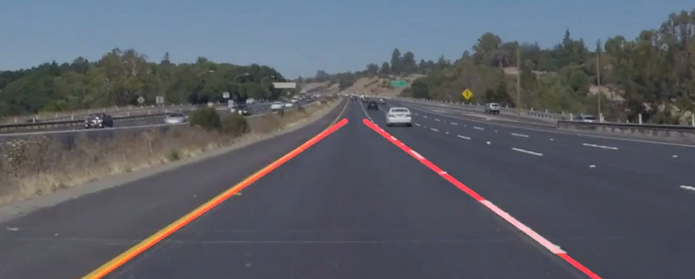  
https://github.com/caudaz/carnd1-proj1   

## carnd1-proj2 - Build a Traffic Sign Recognition Classifier  
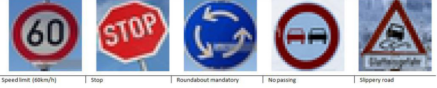  
https://github.com/caudaz/carnd1-proj2  

## carnd1-proj3 - Behavioral Cloning  
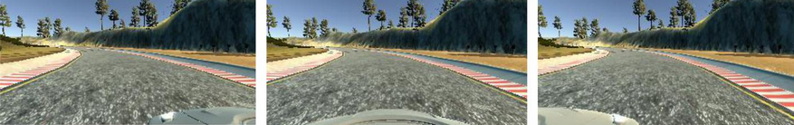  
https://github.com/caudaz/carnd1-proj3  

## carnd1-proj4 - Advanced Lane Finding  
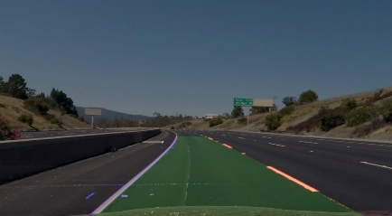  
https://github.com/caudaz/carnd1-proj4  

## carnd1-proj5 - Vehicle Detection  
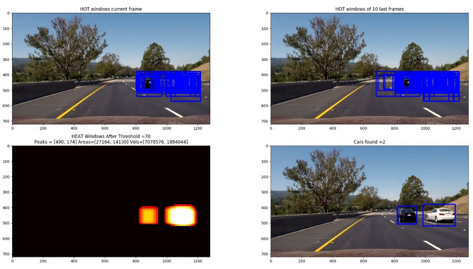  
https://github.com/caudaz/carnd1-proj5  

## carnd2-proj1 - Extended Kalman Filter  
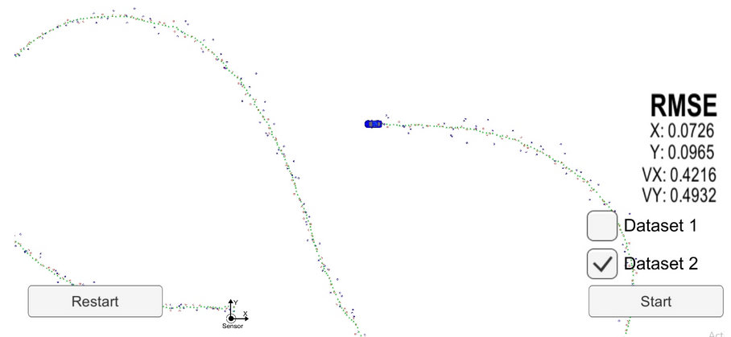  
https://github.com/caudaz/carnd2-proj1  

## carnd2-proj2 - Unscented Kalman Filter (UKF)  
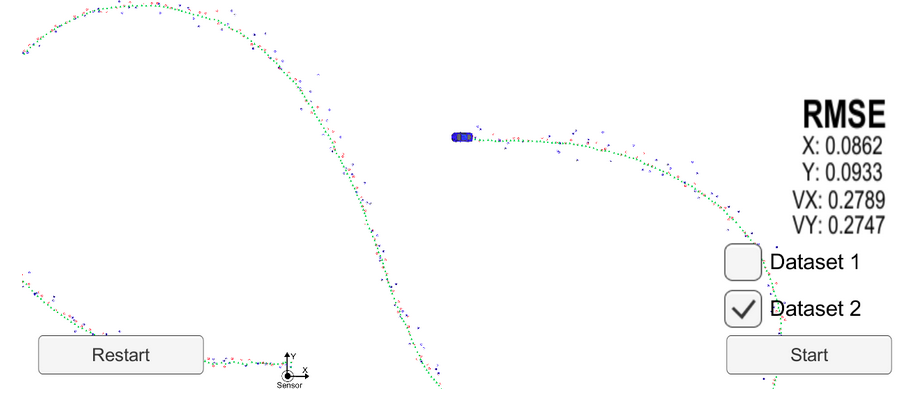  
https://github.com/caudaz/carnd2-proj2  

## carnd2-proj3 - Particle Filters  
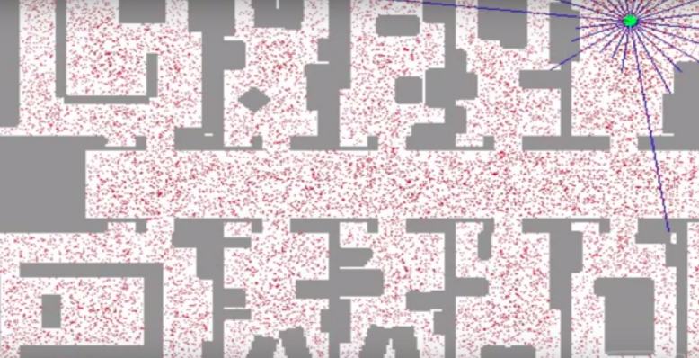  
https://github.com/caudaz/carnd2-proj3  

## carnd2-proj4 - PID Controller  
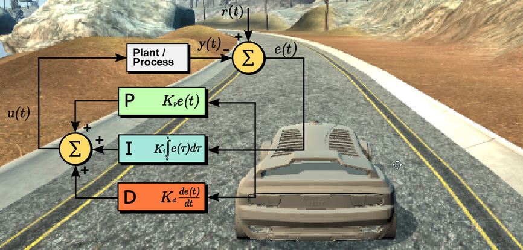  
https://github.com/caudaz/carnd2-proj4  

## carnd2-proj5 - Model Predictive Control (MPC)  
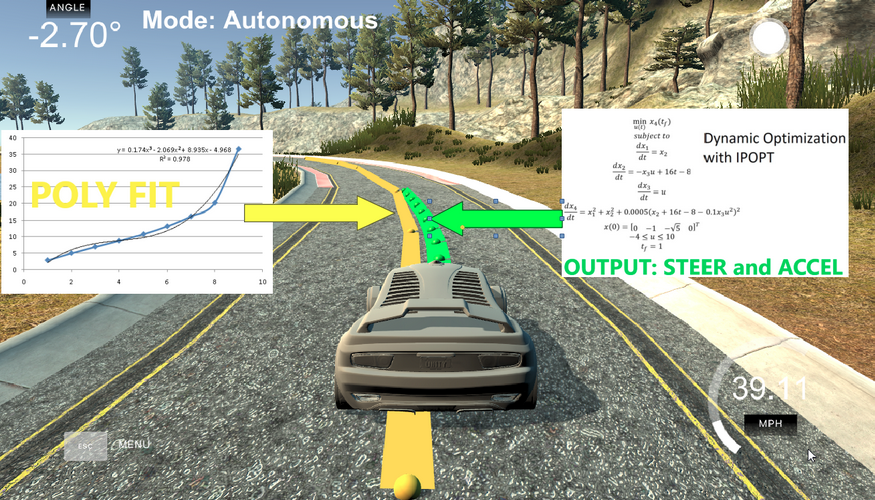  
https://github.com/caudaz/carnd2-proj5  

## carnd3-proj1 - Path Planning  
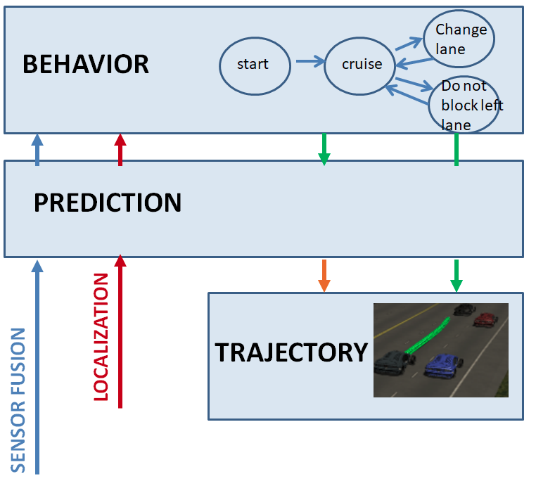  
https://github.com/caudaz/carnd3-proj1  

## carnd3-proj2 - Semantic Segmentation  
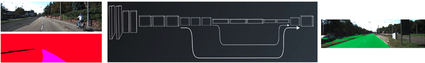  
https://github.com/caudaz/carnd3-proj2  

## carnd3-proj3  
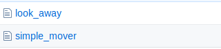  
https://github.com/caudaz/carnd3-proj3  

## carnd3-proj4 - Capstone Project  
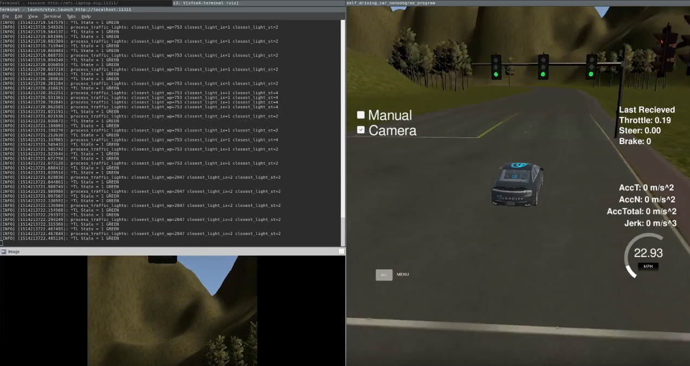  
https://github.com/CarlaRider-Team/CarlaRider-Udacity    

# Robotics NanoDegree

## robotND1-proj1 - Search and Sample Return  
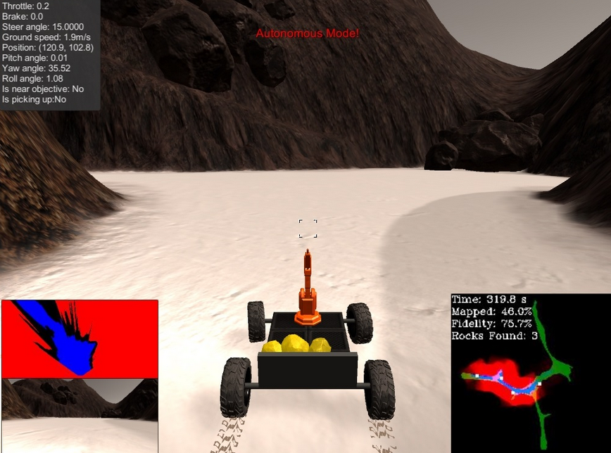  
https://github.com/caudaz/robotND1-proj1  

## robotND1-proj2 - Robotic arm - Pick & Place  
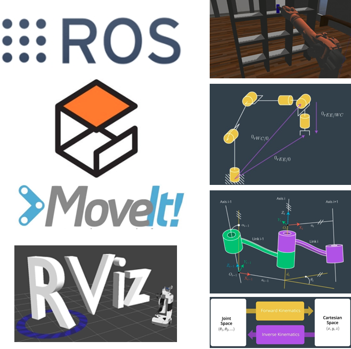  
https://github.com/caudaz/robotND1-proj2  
https://github.com/caudaz/RoboND-Kinematics-Project  

## robotND1-proj3 - 3D Perception  
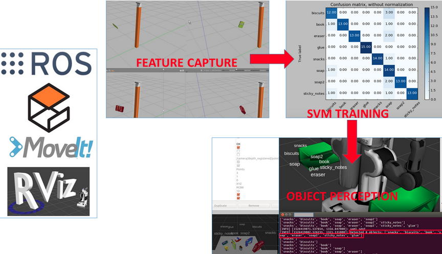  
https://github.com/caudaz/robotND1-proj3  
https://github.com/caudaz/robotND1-proj3/blob/master/class_code/README.md  
https://github.com/caudaz/robotND1-proj3/blob/master/class_code/L17-Exercise-1/README.md  
https://github.com/caudaz/robotND1-proj3/blob/master/class_code/L17_Exercise-2/README.md  
https://github.com/caudaz/robotND1-proj3/blob/master/class_code/L17_Exercise-3/README.md  
https://github.com/caudaz/RoboND-Perception-Project   

## robotND1-proj4 - Follow Me  
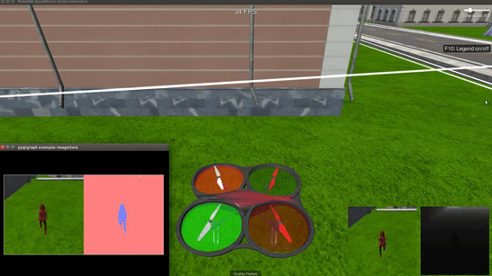  
https://github.com/caudaz/robotND1-proj4  
https://github.com/caudaz/robotND1-proj4_Quadrotor_PID  
https://github.com/caudaz/robotND1-proj4_Segmentation_Lab  
https://github.com/caudaz/robotND1-proj4_exercises   

## robotND2-proj1 - Robotic Inference  
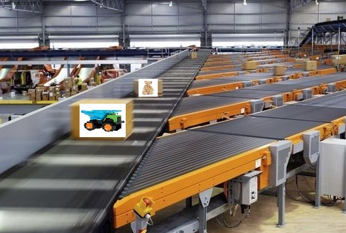  
https://github.com/caudaz/robotND2-proj1   

## robotND2-proj2 - Where Am I? (Particle Filters)  
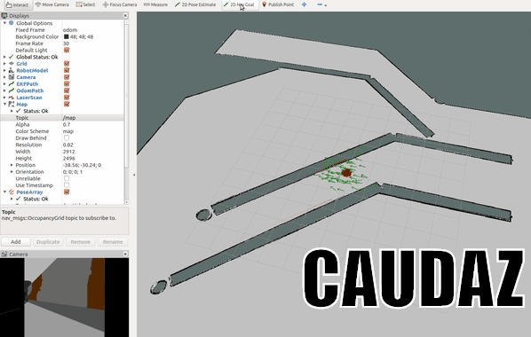  
https://github.com/caudaz/robotND2-proj2  
https://github.com/caudaz/robotND2-proj2_MCL-Lab  
https://github.com/caudaz/RoboND-MCL-Lab   

## robotND2-proj3 - ROS Map My World Robot using RTAB-Map  
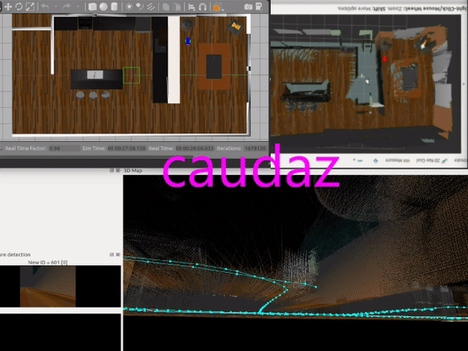  
https://github.com/caudaz/robotND2-proj3   

## robotND2-proj4 - DeepRL Arm Manipulation  
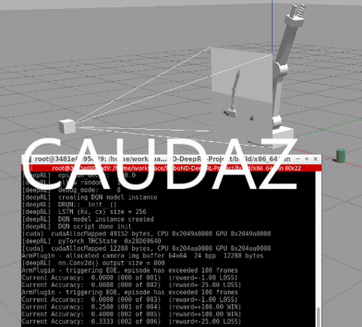  
https://github.com/caudaz/robotND2-proj4   

## robotND2-proj5 - ROS Turtlebot gmapping  
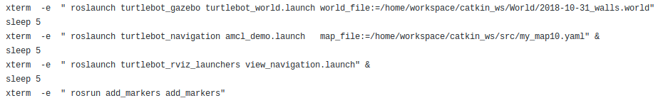  
https://github.com/caudaz/robotND2-proj5   

